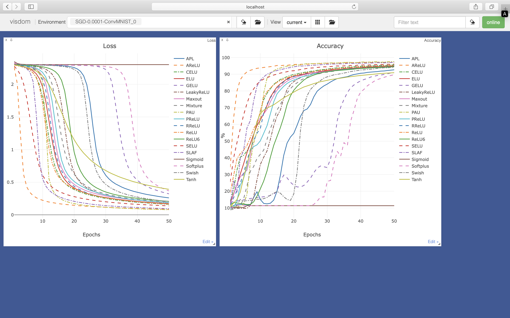
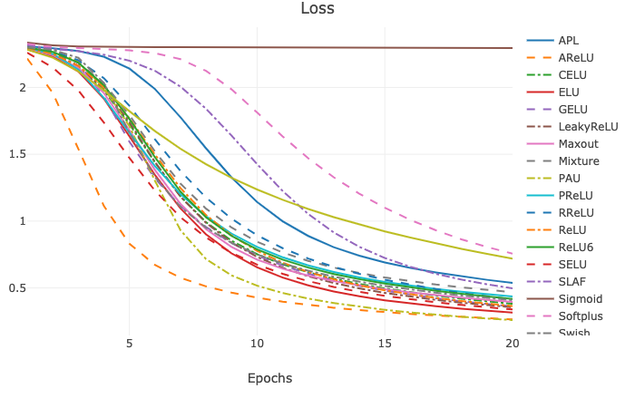
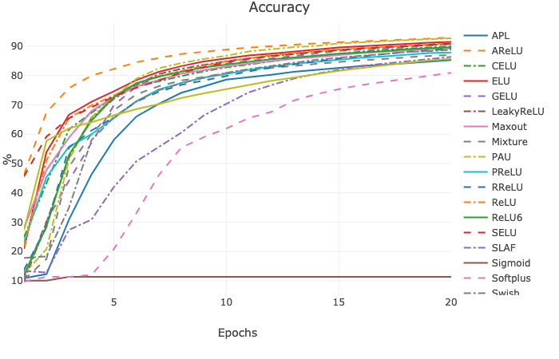
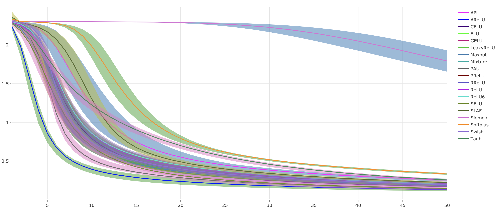
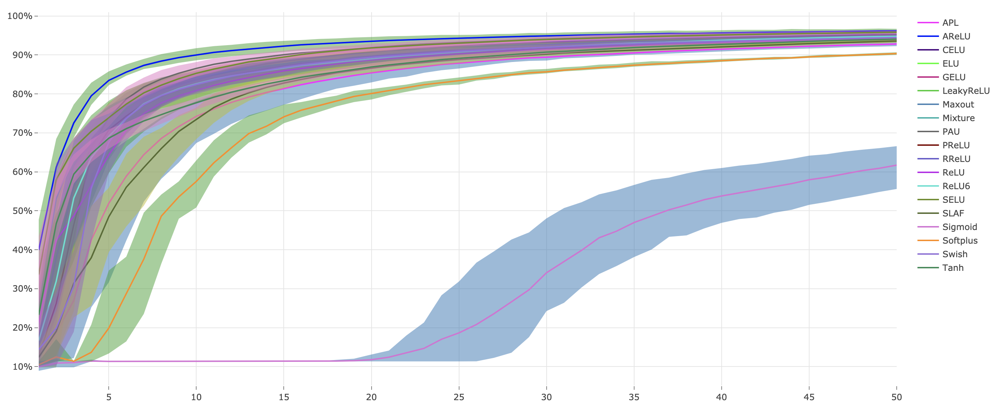

# AReLU: Attention-based-Rectified-Linear-Unit

Activation Function Player with PyTorch.

## Content

* 1. [Introduction](#1)
* 2. [Install](#2)
* 3. [Run](#3)
* 4. [Explore](#4)
* 5. [More tasks](#5)
* 6. [Transfer learning](#6)
* 7. [Json to Latex](#7)

##  <h2 id="1">1. Introduction</h2>

This repository is the implementation of paper [AReLU: Attention-based-Rectified-Linear-Unit](AReLU).

While developing, we found that this repo is quite convenient for people doing experiments with different activation functions, datasets, learning ratings, optimizers and network structures. 
It is easy for us to add new activation functions and network structures into program. 
What's more, based on visdom and ploty, a nice visualization of training procedure and testing accuracy has been provided.

**This project is friendly to newcomers of PyTorch.**

## <h2 id="2">2. Install</h2>

```shell
conda create -n AFP python=3.7 -y
conda activate AFP
pip install -r requirements.txt
```

**NOTE**: PAU is only CUDA supported. You have to compile it first:

```shell
pip install airspeed==0.5.14 

cd activations/pau/cuda
python setup.py install
```

The code of PAU is directly token from [PAU](https://github.com/ml-research/pau.git), if you occur any problems while compiling, please refer to the original repository.

If you just want to have a quick start, and do not want to compile with PAU, just comment out the following lines in [activations/\_\_init\_\_.py](activations/__init__.py):

```python
try:
    from .pau.utils import PAU
    __class_dict__["PAU"] = PAU
except Exception:
    raise NotImplementedError("")
```

## <h2 id="3">3. Run</h2>

### Prepare

We use visdom to visualize training process. 
Before training, please setup visdom server:

```shell
python -m visdom.server &
```

Now, you can click [here](http://localhost:8097/) to check your training loss and testing accuracy while runtime.



**NOTE**: Don't worry about training data. The program will download the MNIST dataset while runtime and save it under `args.data_root`

### Quick start

If you want to have a quick start with default parameters, just run:

```shell
python main.py --cuda
```

We plot the Continuous Error Bars with ploty and save it as a html file under `results` folder. 
A json file which records same static data is also generated and saved under `results`.

Training loss (visualzie on visdom: [http://localhost:8097/](http://localhost:8097/)):



Testing accuracy (visualize on visdom: [http://localhost:8097/](http://localhost:8097/)):



Continuous Error Bars of training loss with five runs (saved under `results` as html file):



Continuous Error Bars of testing accuracy with five runs (saved under `results` as html file):




### Run with different parameters

```shell
python main.py -h
    usage: main.py [-h] [--batch_size BATCH_SIZE] [--lr LR] [--epochs EPOCHS]
                [--times TIMES] [--data_root DATA_ROOT]
                [--dataset {MNIST,SVHN}] [--num_workers NUM_WORKERS]
                [--net {BaseModel,ConvMNIST,LinearMNIST}] [--resume RESUME]
                [--af {APL,AReLU,GELU,Maxout,Mixture,SLAF,Swish,ReLU,ReLU6,Sigmoid,LeakyReLU,ELU,PReLU,SELU,Tanh,RReLU,CELU,Softplus,PAU,all}]
                [--optim {SGD,Adam}] [--cuda]
                [--exname {AFS,TransferLearningPretrain,TransferLearningFinetune}]

    Activation Player with PyTorch.

    optional arguments:
    -h, --help            show this help message and exit
    --batch_size BATCH_SIZE
                            batch size for training
    --lr LR               learning rate
    --epochs EPOCHS       training epochs
    --times TIMES         repeat runing times
    --data_root DATA_ROOT
                            the path to dataset
    --dataset {MNIST,SVHN}
                            the dataset to play with.
    --num_workers NUM_WORKERS
                            number of workers to load data
    --net {BaseModel,ConvMNIST,LinearMNIST}
                            network architecture for experiments. you can add new
                            models in ./models.
    --resume RESUME       pretrained path to resume
    --af {APL,AReLU,GELU,Maxout,Mixture,SLAF,Swish,ReLU,ReLU6,Sigmoid,LeakyReLU,ELU,PReLU,SELU,Tanh,RReLU,CELU,Softplus,PAU,all}
                            the activation function used in experiments. you can
                            specify an activation function by name, or try with
                            all activation functions by `all`
    --optim {SGD,Adam}    optimizer used in training.
    --cuda                with cuda training. this would be much faster.
    --exname {AFS,TransferLearningPretrain,TransferLearningFinetune}
                            experiment name of visdom.
```

### Full training

We provide a script for doing a full training with all activation functions, learning rates, optimizers and network structures.

Just run:

```shell
./train.sh
```

**NOTE**: This step is time consuming.

## <h2 id="4">4. Explore</h2>

### New activation functions

1. write a python script file under `activations`, such as *new_activation_functions.py*, where contains the implementation of new activation function.

2. import new activation functions in [activations/\_\_init\_\_.py](activations/__init__.py), like:

    ```python
    from .new_activation_functions import NewActivationFunctions
    ```

3. Enjoy it!

### New network structure

1. Write a python script file under `models`, such as *new_network_structure.py*, where contains the definition of new network structure. New defined network structure should be a subclass of **BaseModel**, which defined in `models/models.py`. Such as:

    ```python
    from models import BaseModel
    import torch
    import torch.nn as nn
    import torch.nn.functional as F


    class LinearMNIST(BaseModel):
        def __init__(self, activation: nn.Module):
            super().__init__(activation)

            self.linear1 = nn.Sequential(
                nn.Linear(28 * 28, 512),
                activation(),
            )

            self.linear2 = nn.Sequential(
                nn.Linear(512, 10),
                nn.LogSoftmax(dim=-1)
            )

        def forward(self, x):
            x = x.view(-1, 28 * 28)

            x = self.linear1(x)

            x = self.linear2(x)

            return x
    ```

2. Import new network structure in [models/\_\_init\_\_/py](models/__init__.py), like:

    ```python
    from .conv import ConvMNIST
    ```

3. Enjoy it!

### More

You can modify `main.py` to try with more datasets and optimizers.

## <h2 id="5">5. More tasks</h2>

### Classification

You can refer to [CIFAR10](https://github.com/kuangliu/pytorch-cifar.git) and [CIFAR100](https://github.com/weiaicunzai/pytorch-cifar100.git) for more experiments with popular network structures.
After downloading the repo, you just copy `activations` folder into repo, and modify some code.

### Segmentation

You can refer to [Detectron2](https://github.com/facebookresearch/detectron2.git) for more experiments on segmentation. And refer to [UNet-Brain](https://github.com/mateuszbuda/brain-segmentation-pytorch.git) for a simple test with UNet on brain segmentation.

## <h2 id="6">6. Transfer learning</h2>

We provide a simple script to play with transfer learning between MNIST and SVHN.

```shell
./transfer_learning.sh
```

## <h2 id="7">7. Json to Latex</h2>

We provide a lightly python script that can collect the json file data which generated under `result` folder to readable latex code.

```shell
python json_to_latex.py -h
    usage: json_to_latex.py [-h] [--exname EXNAME] [--data {best,mean,std}]
                            [--epoch {first epoch,best}] [--output OUTPUT]

    Json to LaTex (Lightly)

    optional arguments:
    -h, --help            show this help message and exit
    --exname EXNAME       exname to generate json
    --data {best,mean,std}
                            best: best accuracy, mean: mean accuracy, std: std of
                            acc
    --epoch {first epoch,best}
                            which epoch to load.
    --output OUTPUT       output filename
```